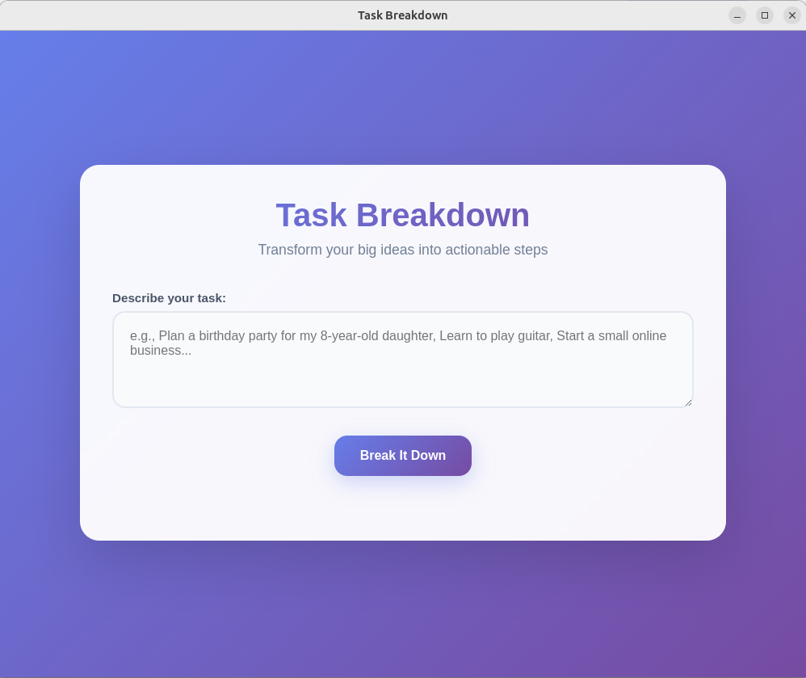
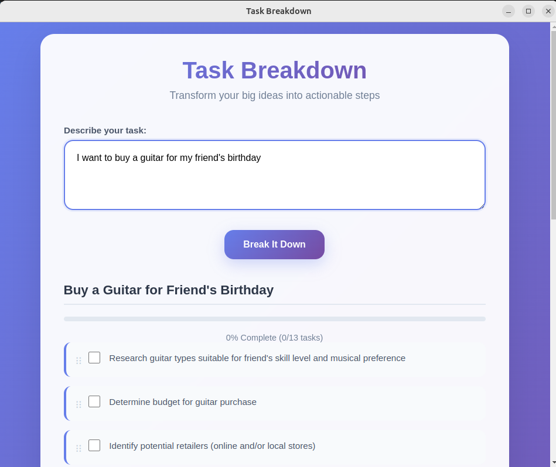
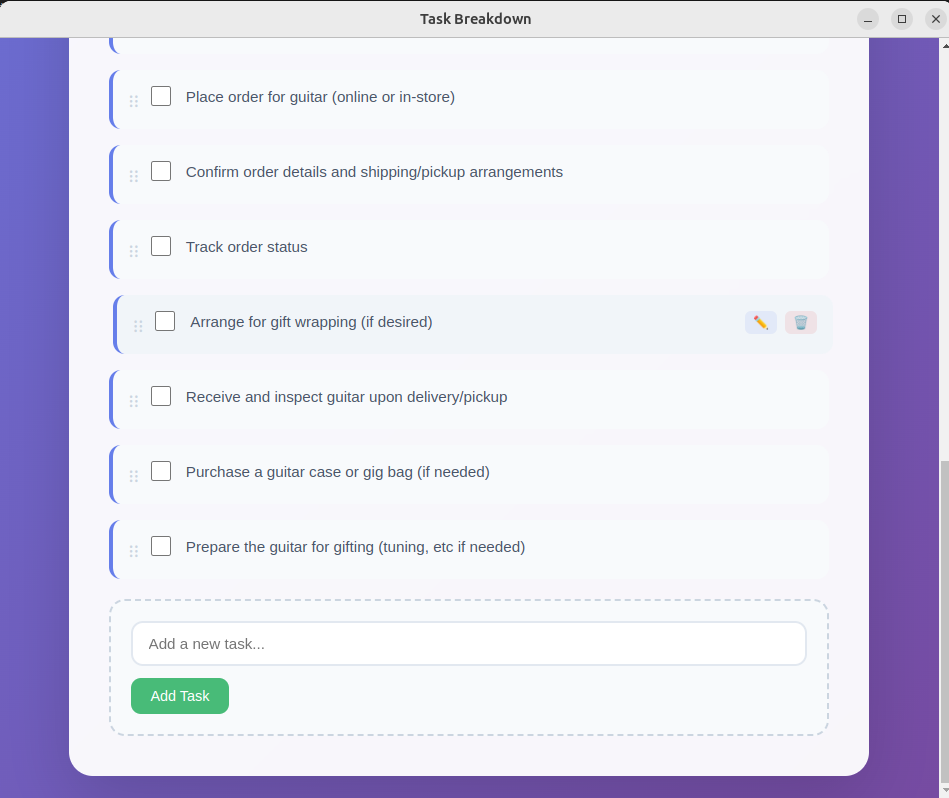

# TaskMaster AI

TaskMaster is a sleek desktop application that uses the power of Google's Gemini AI to break down large, complex tasks into small, manageable subtasks. It provides an intuitive drag-and-drop interface to help you organize your plan and track your progress.

Built with a Python/Flask backend and an Electron frontend, it's a powerful example of a hybrid desktop application.






## Features

-   **AI-Powered Task Breakdown**: Describe any task, and let the AI generate a step-by-step plan for you.
-   **Interactive Checklist**: Check off items as you complete them and watch your progress bar fill up.
-   **Drag & Drop Reordering**: Easily reorder subtasks to fit your workflow.
-   **Full CRUD Functionality**:
    -   **C**reate new custom tasks.
    -   **R**ead and review your task list.
    -   **U**pdate tasks by double-clicking to edit them.
    -   **D**elete tasks you no longer need.
-   **Standalone Desktop App**: Runs in its own window, just like a native application (thanks to Electron).
-   **Simple Command-Line Launch**: Once set up, just type `taskmaster` in your terminal to run the app.

## Installation

Follow these steps to get TaskMaster running on your local machine.

### Prerequisites

-   [Python 3.8+](https://www.python.org/downloads/)
-   [Node.js and npm](https://nodejs.org/en/download/)
-   [Git](https://git-scm.com/downloads)

### 1. Clone the Repository

First, clone this repository to your local machine.

```bash
git clone https://github.com/your-username/taskmaster.git
cd taskmaster
```

*(Replace `your-username/taskmaster.git` with the actual URL of your repository if you've hosted it on GitHub.)*

### 2. Run the Setup Script

The setup script automates the entire installation process, including setting up Python and Node dependencies and creating the launch alias.

```bash
chmod +x setup.sh run.sh
./setup.sh
```

This script will:
- Create a Python virtual environment (`task_breakdown_env`).
- Install all required Python packages (`Flask`, `google-generativeai`, etc.).
- Install all required Node.js packages (`electron`).
- Create a permanent `taskmaster` command (alias) in your shell.

### 3. Add Your API Key

The application requires a Google Gemini API key to function.

1.  Get your free API key from [Google AI Studio](https://aistudio.google.com/app/apikey).
2.  Open the `.env` file that was created in the project directory.
3.  Replace `your-api-key-here` with your actual API key.

    ```ini
    # .env
    GEMINI_API_KEY=xxxxxxxxxxxxxxxxxxxxxxxxxx
    ```

### 4. Reload Your Shell

For the `taskmaster` command to become active, you must reload your shell's configuration file or simply open a new terminal window.

```bash
# For bash users (most common on Linux)
source ~/.bashrc

# For zsh users (common on macOS)
source ~/.zshrc
```

## Usage

After completing the installation, you can run the application from **any directory** in your terminal by simply typing:

```bash
taskmaster
```

The Electron application window will launch, and you can start breaking down your tasks!

## For Developers

### Running in Development Mode

To run the app with live-reloading and access to developer tools, you can use the standard npm start command from the project directory.

```bash
npm start
```

### Building the Application

You can build a distributable, standalone application for your platform using `electron-builder`.

```bash
# Build for your current OS
npm run build

# Build specifically for Linux
npm run build-linux
```
The final application (e.g., `.AppImage`, `.deb`, `.exe`) will be located in the `dist/` directory.

## Troubleshooting

### Linux SUID Sandbox Error

If you are on Linux and encounter an error like `The SUID sandbox helper binary was found, but is not configured correctly`, it's a common Electron permissions issue.

**Fix:** Run the following command to set the correct permissions for the sandbox helper.

```bash
sudo chown root:root node_modules/electron/dist/chrome-sandbox && sudo chmod 4755 node_modules/electron/dist/chrome-sandbox
```

After running this command, the `taskmaster` command should work correctly.

## License

This project is licensed under the MIT License.